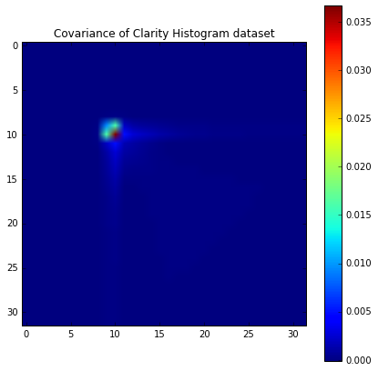

## Progress Report - March 23rd, 2016
**Table of Contents:**
- [Overview](./progress_report.md#overview)
- [Scientific Questioning](./progress_report.md#scientific-questioning)
  - [Decriptive Analysis](./progress_report.md#descriptive-analysis)
  - [Exploratory Analysis](./progress_report.md#exploratory-analysis)
  - [Inferential Analysis](./progress_report.md#inferential-analysis)
  - [Predictive Analysis](./progress_report.md#predictive-analysis)
  - [Testing Assumptions](./progress_report.md#testing-assumptions)
  - [Next Steps](./progress_report.md#next-steps)
- [Methods](./progress_report.md#methods)
  - [Decriptive Analysis](./progress_report.md#descriptive-analysis-1)
  - [Exploratory Analysis](./progress_report.md#exploratory-analysis-1)
  - [Inferential Analysis](./progress_report.md#inferential-analysis-1)
  - [Predictive Analysis](./progress_report.md#predictive-analysis-1)
  - [Testing Assumptions](./progress_report.md#testing-assumptions-1)

----------

### Overview
Clarity brain imaging will allow rapid extraction of systems information from large and intact biological tissues or organs without disassembly,down to milli-second scale and cellular resolution. Analysing Clarity can potentially unlock the secrets behind the correlation between behaviour and brain structures in different people.

### Scientific Questioning
Exploratory and Descriptive Analysis were used to guide the questions that we decided to tackle. The results from the analysis are discussed in the following sections. 

#### Descriptive Analysis
Working with the data was relatively difficult due to the computationally intensive nature of the image volumes we tried to tackle. We first created an API to visualize the data. Next we converted the images to a csv representation using sparse sampling. By doing so we were able to understand the nuances involved with the Clarity data like intensity, clusters, etc. 
We worked with three datasets, Fear , Cocaine and Control with 3 subjects for each. After asking questions about the data such as dataset size, optimal resolution, we understood that the size of a single dataset [500 GB] can be reduced to a manageable size [0.5 GB] by scaling the resolution by a factor of 5.

#### Exploratory Analysis
After visualizing the Clarity data and understanding where we could potentially generate useful data leads, we explored the images to determine patterns in the intensity of the images.

#### Inferential Analysis
Inferential Analysis was unfortunately not as useful for analysis because due to our extremely small sample size it was difficult to obtain statistically significant results. The main conclusion we reached was that the graphs we created were different from one another...which was obvious without any necessary analysis.

#### Predictive Analysis
Classification was also difficult due to the small sample size. While we went through the traditional sematics of traditional classification, we focused more on the theoretical side of classification.

| Classifier | Accuracy | Standard Deviation |
|------------|----------|--------------------|
|Nearest Neighbors | 0.08 | +/- 0.55 |
|Linear SVM | 0.25 | +/- 0.87 |
|Random Forest| 0.25 | +/- 0.87 |
|Linear Discriminant Analysis| 0.25 | +/- 0.87 |

From these results it is clear that no classifier performs well with the data. 
We changed the bin numbers in hopes of obtaining different results, but unfortunately while the data was indeed different, the data was bad in different ways.
We then decided to reevaluate the assumptions we made initially to better understand our model. 

#### Testing Assumptions
We assumed that the data from different datasets was sampled idependently and identically. We tested each of these assumptions to see if we can impove our model.
 
Plotted below is the Covariance matrix for the assumtpion that our data is sampled independently. 

Plotted below is the Covariance matrix for the assumtpion that our data is identically sampled. 

The assumptions we took for granted were also not necessarily requiring of deep analysis. Since there are 12 different graphs our study concluded that 12 clusters was the optimal number for example.

#### Next Steps
So far we have obtained a greater understanding of our task at hand. Because traditional statistical approaches are futile due to the small sample size, it is important to approach our problem from a more qualitative aspect. Thus we will focus on visualization comparisons, and analysis tools instead. Once more data is obtained, we can use the tools we have created to analyze and then create statistically significant data.

### Methods
The following is the code we have written so far that represents the above categories. Next we will discuss our method for approaching the necessary problems. 

Sahithi please put the links in for the following hw/ipython notebook stuff:

| Question Type | Code |
|---------------|------|
| Descriptive | [**``./code/descriptive_and_exploratory_answers.ipynb``**](./code/descriptive_and_exploratory_answers.ipynb) |
| Exploratory | [**``./code/descriptive_and_exploratory_answers.ipynb``**](./code/descriptive_and_exploratory_answers.ipynb) |
| Inferential | [**``./code/inferential_simulation.ipynb``**](./code/inferential_simulation.ipynb) |
| Predictive  | [**``./code/classification_simulation.ipynb``**](./code/classification_simulation.ipynb) |
| Testing Assumptions | [**``./code/test_assumptions.ipynb``**](./code/test_assumptions.ipynb) |

#### Descriptive Analysis
Answering the descriptive questions required looking at the visualized data and comparing the patterns we observed. Because we quickly realized such patterns would not be analyzable due to the subsampled nature of our visuals, we were forced to redraw descriptive analysis questions that focused more on the visuals.

#### Exploratory Analysis

#### Inferential Analysis
We needed to defined a model for inferential analysis. 

#### Predictive Analysis
5 different classifiers were used. 

Sahithi please insert the classifier graph here:

#### Testing Assumptions
Three different assumptions were taken - 
