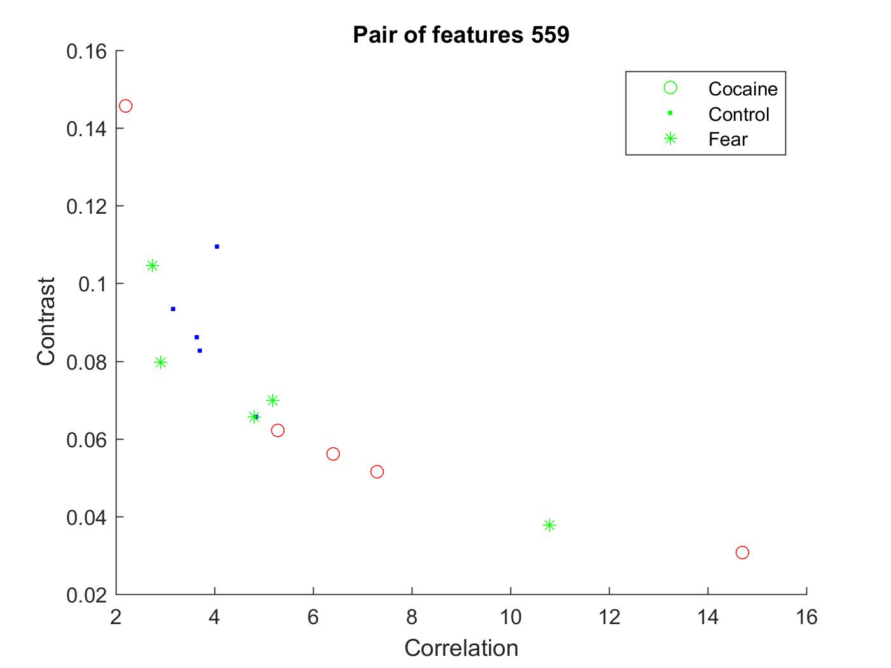
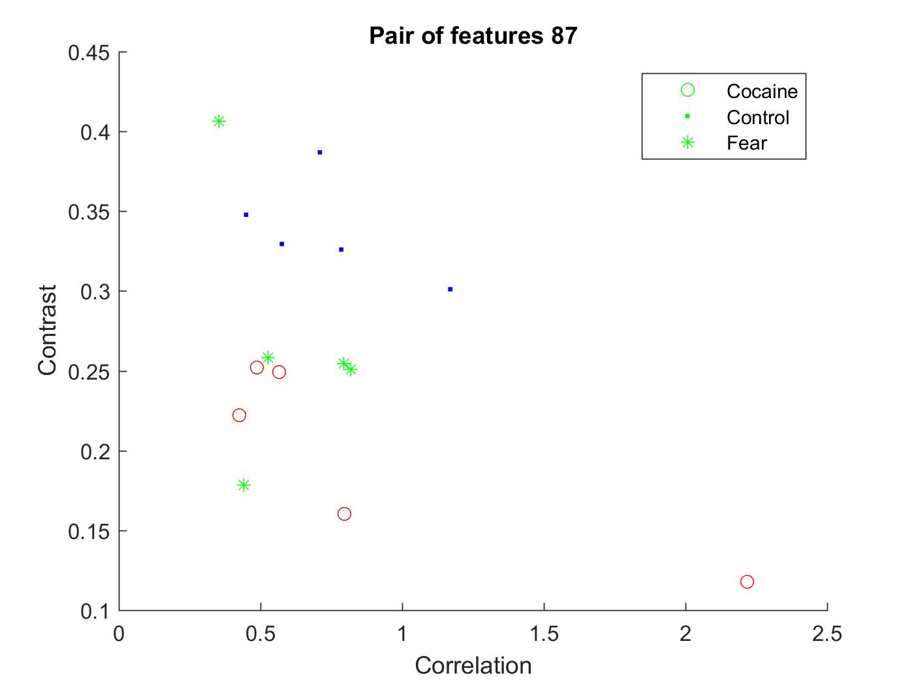

# Assignment 11
## ROI Analysis 

On further studying the Haralick features extracted for each ROI, two ROI's showed significant difference between the data. 

Shown below is the figure for ROI 559 which corresponds to the Central amygdalar nucleus medial part of the mouse brain. 

Shown below is the figure for ROI 559 which corresponds to the Paraventricular hypothalamic nucleus parvicellular division medial parvicellular part dorsal zone of the mouse brain.

The conditions of study involve Fear and Cocaine, which would typically influence the Amygdala and Hippocampal regions respectively.
The ROIs that showed a good classfification of data belong in these groups. It seems like an obvious direction to take to further analyse the CLARITY brains. 

Correlation and contrast features were chosen for this intial investigation as they showed a good difference in the analysis done in [assignment_11](claritycontrol/assignments/a11_WeiWang_classfication_analysis.ipynb).
