# ROI 87 Analysis 
We further studyied the ROI 87, that corresponds to Paraventricular hypothalamic nucleus parvicellular division medial parvicellular part dorsal zone,
the region we hoped to find good classification between Control and Cocaine. 
The results when we used the Pair of Features technique are plotted in the [matlab script] (https://github.com/Upward-Spiral-Science/claritycontrol/blob/master/code/data/MATLAB%20files/clarityroi3.m).

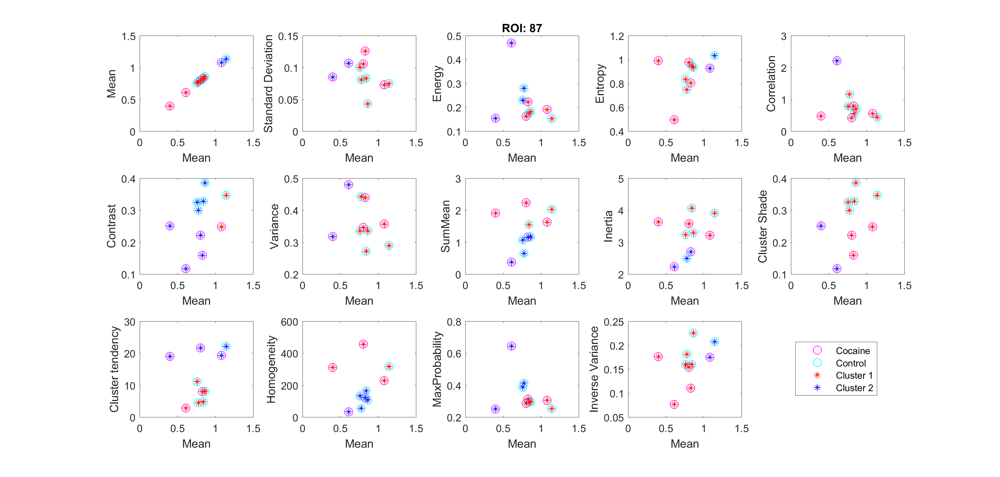

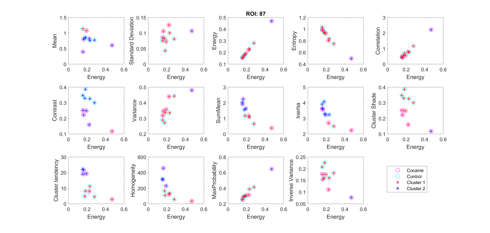

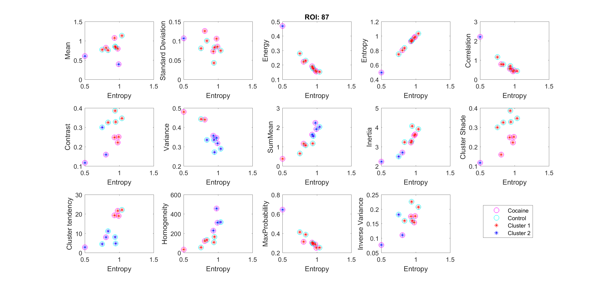

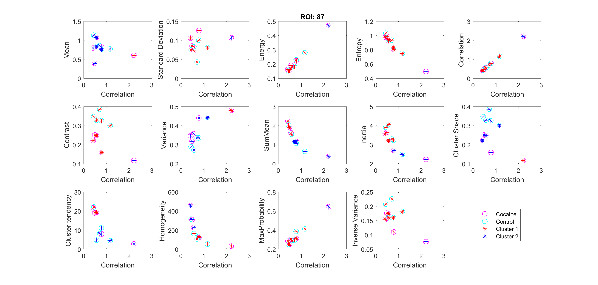

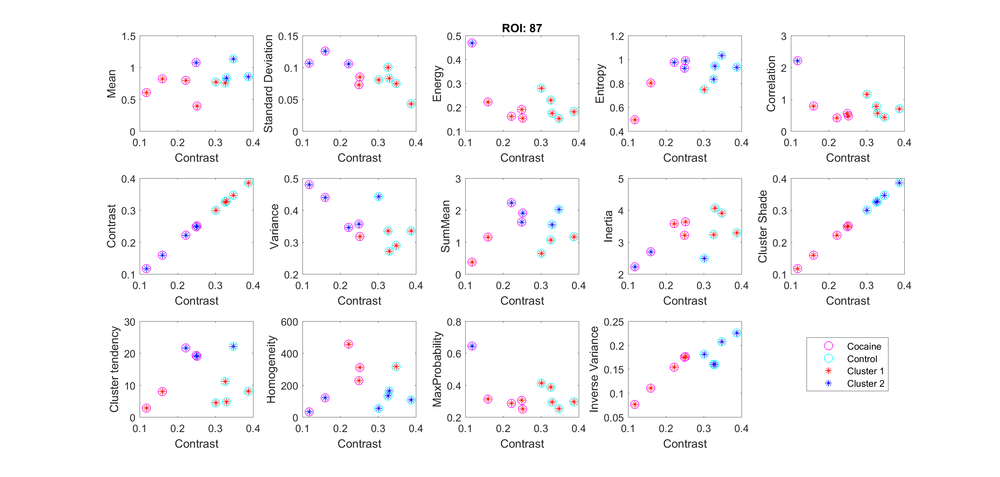

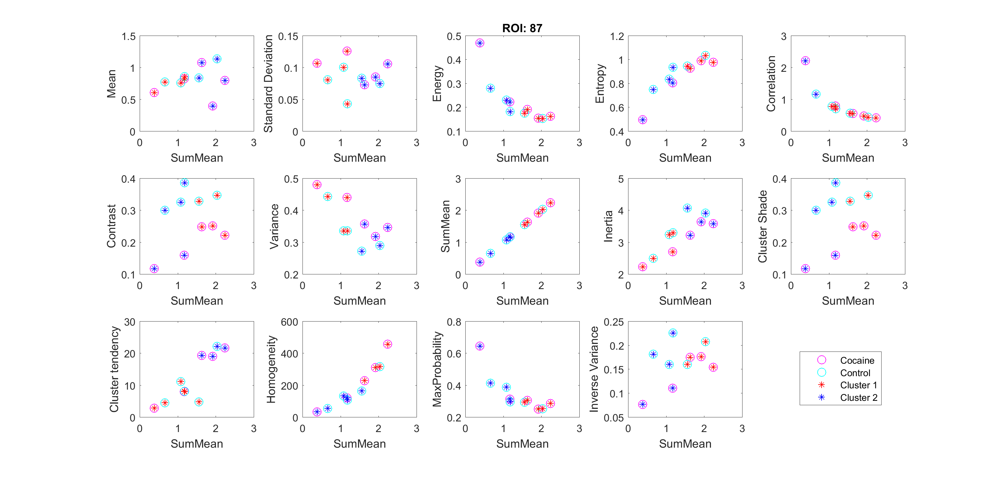

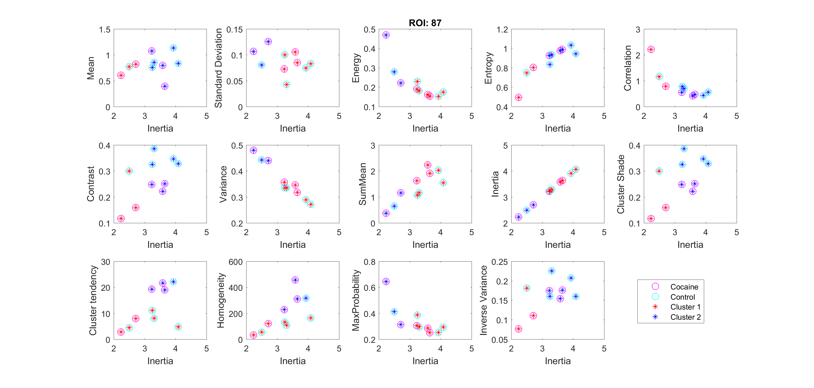

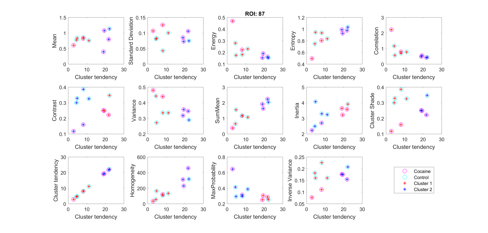

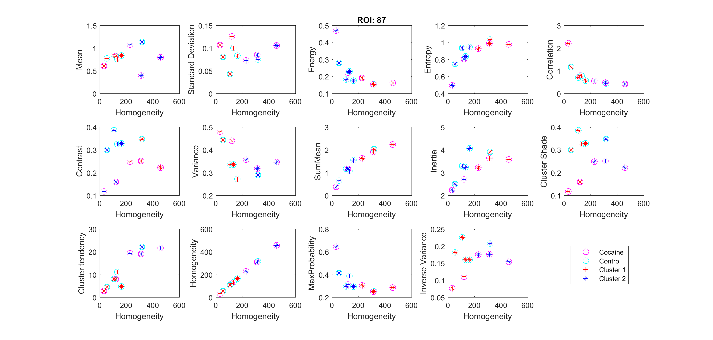

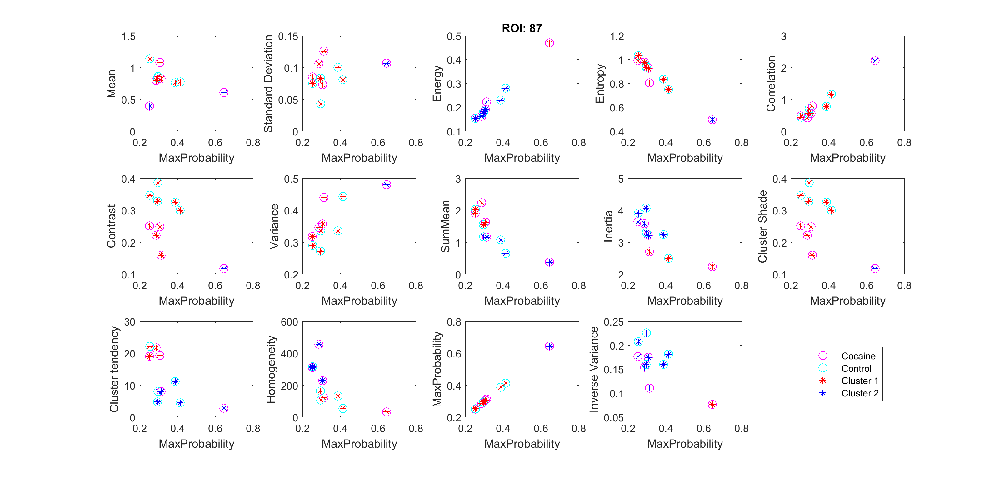

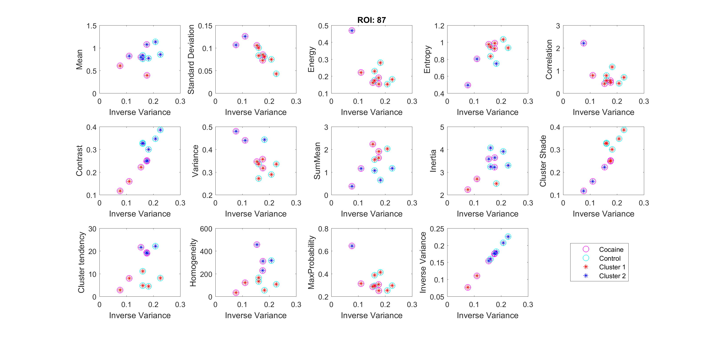

The next step, or the final step would be to run this analysis on every ROI previously extracted and hopefully classify the brains. 
